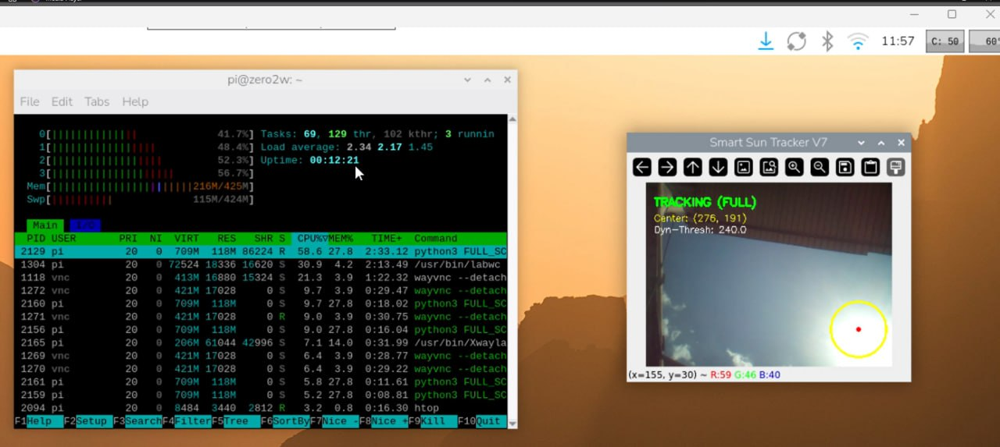

# ☀️ Smart Sun Tracker

### Real-Time Sun Detection and Tracking Using Raspberry Pi & OpenCV

A lightweight real-time computer vision system for detecting and
tracking the sun using a **Raspberry Pi Zero 2 W**, **Raspberry Pi
Camera**, **Python**, **OpenCV**, and **NumPy**.

The project was developed as an **engineering internship project**, with
a focus on image processing, embedded computer vision, real-time
tracking, algorithm debugging, and computational efficiency.

------------------------------------------------------------------------

## 📌 Project Overview

The Smart Sun Tracker processes live camera frames and identifies the
sun as a dominant bright object in the upper region of the image.

Instead of performing a complete image search on every frame, the system
combines:

-   Dynamic brightness thresholding
-   HSV color-space processing
-   Morphological image processing
-   Contour analysis
-   Sun-center estimation
-   ROI-based local tracking
-   Periodic full-frame re-detection
-   Lost-target recovery
-   Multi-frame detection confirmation
-   Real-time visualization

The result is a lightweight tracking pipeline designed to run on
embedded hardware with limited computational resources.

------------------------------------------------------------------------

## ✨ Key Features

  -----------------------------------------------------------------------
  Feature                             Description
  ----------------------------------- -----------------------------------
  📷 Real-time acquisition            Captures live frames using
                                      Picamera2

  🎨 HSV processing                   Uses the Value (V) channel for
                                      brightness analysis

  ☀️ Dynamic thresholding             Adapts the brightness threshold to
                                      current illumination

  🧹 Morphological filtering          Removes noise and improves detected
                                      regions

  🔎 Contour analysis                 Extracts and evaluates bright
                                      candidate regions

  📍 Center estimation                Calculates the detected sun's image
                                      coordinates

  ⭕ Radius estimation                Estimates an equivalent radius from
                                      contour area

  🎯 ROI tracking                     Searches locally around the
                                      previous sun position

  🔄 Full-frame recovery              Periodically performs a complete
                                      image search

  🛡️ Lost-target handling             Returns to full-frame detection
                                      after repeated failures

  ⏱️ Temporal confirmation            Requires multiple consecutive
                                      detections

  🖥️ Live visualization               Displays detection, tracking state,
                                      coordinates, threshold, and ROI

  🎬 Animation                        Provides a visual tracking-status
                                      animation
  -----------------------------------------------------------------------

------------------------------------------------------------------------

## 🧰 Hardware

### Raspberry Pi Zero 2 W

The system is designed to run on a **Raspberry Pi Zero 2 W**, providing
a compact embedded computing platform for real-time computer vision.

### Camera

A Raspberry Pi-compatible camera is used to capture the scene containing
the sun.

> **Note:** The exact camera model and optical specifications are
> intentionally not assumed here. Add the exact camera model to this
> section if required.

### Hardware Pipeline

``` text
        ☀️ Sun
          │
          ▼
   ┌───────────────┐
   │ Raspberry Pi  │
   │    Camera     │
   └───────┬───────┘
           │
           ▼
   ┌────────────────┐
   │ Raspberry Pi   │
   │   Zero 2 W     │
   └───────┬────────┘
           │
           ▼
      Picamera2
           │
           ▼
    Python + OpenCV
           │
           ▼
   Sun Detection
           │
           ▼
    Sun Tracking
           │
           ▼
   Real-Time Output
```

------------------------------------------------------------------------

## 💻 Software Stack

-   **Python 3**
-   **OpenCV**
-   **NumPy**
-   **Picamera2**
-   **Raspberry Pi OS / Linux**
-   **Tk/GTK/OpenCV display environment as provided by the Raspberry Pi
    installation**

The core processing is implemented in a single Python program.

------------------------------------------------------------------------

## 🧠 How the Algorithm Works

The processing pipeline follows these major stages:

``` text
Camera Frame
     │
     ▼
RGB → BGR Conversion
     │
     ▼
HSV Conversion
     │
     ▼
Value Channel Extraction
     │
     ▼
Upper 90% Sky Region
     │
     ▼
Maximum Brightness Detection
     │
     ▼
Dynamic Threshold
     │
     ▼
Binary Brightness Mask
     │
     ▼
Morphological Opening
     │
     ▼
Morphological Closing
     │
     ▼
Contour Detection
     │
     ▼
Area Filtering
     │
     ▼
Sun Center Estimation
     │
     ▼
ROI Tracking / Full Search
     │
     ▼
Real-Time Visualization
```

### Dynamic Thresholding

The detector determines the brightest region of the current frame and
calculates:

``` text
dynamic_thresh = max(ABSOLUTE_MIN_BRIGHTNESS, max_val - 15)
```

This allows the detector to adapt to changing illumination instead of
relying on a single fixed brightness threshold.

### Morphological Processing

Two morphological operations are applied:

-   **Opening:** removes small isolated noise.
-   **Closing:** fills small gaps and produces more coherent bright
    regions.

The implementation uses elliptical kernels of:

-   `3 × 3` for opening
-   `9 × 9` for closing

### Contour Analysis

Candidate contours are filtered according to their relative area.

The center is calculated from image moments:

``` text
cx = M10 / M00
cy = M01 / M00
```

An equivalent radius is then estimated from the contour area:

``` text
r = sqrt(A / π)
```

This is an **image-space equivalent radius**, not a physical measurement
of the sun's angular or real-world radius.

------------------------------------------------------------------------

## 🎯 ROI-Based Tracking

One of the main design decisions in the final implementation is the use
of **Region of Interest (ROI) tracking**.

After the sun is detected, the next search is normally performed around
the previous center rather than across the entire frame.

The configured ROI window is:

``` text
80 × 80 pixels
```

This reduces the amount of image data that needs to be processed during
normal tracking.

### Tracking Logic

``` text
Is tracking active?
       │
   ┌───┴───┐
   │       │
  YES      NO
   │       │
   ▼       ▼
Search ROI  Full-frame search
   │
   ▼
Detection successful?
   │
 ┌─┴─┐
YES  NO
 │    │
 ▼    ▼
Update   Increase lost counter
center        │
 │            ▼
 │       Lost limit reached?
 │            │
 │            ▼
 │       Disable tracking
 │            │
 └────────────┴──────► Full search
```

If the target is lost for the configured number of frames, the tracker
disables ROI tracking and returns to a full-frame search.

A full-frame scan is also performed periodically to recover from
tracking drift.

------------------------------------------------------------------------

## ⚙️ Configuration Parameters

  ------------------------------------------------------------------------------
  Parameter                                          Value Purpose
  --------------------------- ---------------------------- ---------------------
  `MIN_SUN_AREA_RATIO`                            `0.0007` Minimum acceptable
                                                           contour area

  `MAX_SUN_AREA_RATIO`                               `0.1` Maximum acceptable
                                                           contour area

  `ABSOLUTE_MIN_BRIGHTNESS`                          `100` Minimum brightness
                                                           threshold

  `TRACKING_WINDOW`                                   `80` ROI tracking window
                                                           size

  `TRACK_LOST_FRAMES`                                 `10` Consecutive failures
                                                           before tracking is
                                                           reset

  `START_CONFIRM_FRAMES`                               `3` Frames required to
                                                           confirm a detection

  `FULL_SCAN_INTERVAL`                             `3.0 s` Periodic full-frame
                                                           search interval

  `ANIMATION_INTERVAL`                             `6.0 s` Interval between
                                                           visual animations

  `ANIMATION_DURATION`                             `0.8 s` Duration of the
                                                           animation
  ------------------------------------------------------------------------------

The camera processing configuration is:

``` text
Resolution: 320 × 240
Configured FPS: 15
```

> **Important:** `15 FPS` is the configured target in the program. It
> should not be interpreted as a measured achieved frame rate unless an
> independent FPS measurement is performed.

------------------------------------------------------------------------

## 🖥️ Final System Output

The application provides a real-time OpenCV visualization containing:

-   🟡 Yellow circle around the detected sun
-   🔴 Red point indicating the estimated center
-   🟢 Tracking status
-   📍 Estimated center coordinates
-   📊 Dynamic brightness threshold
-   ⬜ ROI rectangle during local tracking
-   🔳 Animated visual feedback

### Output Screenshot

Place the final screenshot at:

``` text
docs/images/final_output.png
```

Then uncomment or replace the following image reference:

```html
<p align="center">
  
</p>

<p align="center">
  <strong>📷 Final System Output</strong><br>
  <em>Real-time output of the Smart Sun Tracker.</em>
</p>

------------------------------------------------------------------------

## ▶️ Video Demonstrations

Two demonstration videos are available.

### 🎥 Normal Test

[▶ Watch the Normal
Test](https://iutbox.iut.ac.ir/index.php/s/JxYwCMDrKEZeYJn)

This video demonstrates the system during a normal operating condition.

### ☁️ Cloudy / Cloud Test

[▶ Watch the Cloud
Test](https://iutbox.iut.ac.ir/index.php/s/Rqq86Ko6QMFNdHj?dir=/&editing=false&openfile=true)

This video demonstrates the system under cloudy / changing-sky
conditions.

> If the external video links require authentication or institutional
> access, make sure the sharing permissions allow the intended viewers
> to access them.

------------------------------------------------------------------------

# 🚀 Installation

## 1. Clone the Repository

``` bash
git clone https://github.com/YOUR_USERNAME/smart-sun-tracker.git
cd smart-sun-tracker
```

Replace `YOUR_USERNAME` with your GitHub username and adjust the
repository name if necessary.

------------------------------------------------------------------------

## 2. Update the Raspberry Pi

``` bash
sudo apt update
sudo apt upgrade -y
```

------------------------------------------------------------------------

## 3. Install Required System Packages

``` bash
sudo apt install -y python3-opencv python3-numpy python3-picamera2
```

If `python3-picamera2` is not available on the installed Raspberry Pi OS
image, install Picamera2 using the official Raspberry Pi OS
package/repository appropriate for your OS version.

------------------------------------------------------------------------

## 4. Verify the Camera

Before running the application, verify that the camera is detected:

``` bash
rpicam-hello
```

On systems using the older camera command naming, the equivalent command
may be:

``` bash
libcamera-hello
```

A successful preview confirms that the camera subsystem is available.

------------------------------------------------------------------------

# ▶️ Running the Project

After connecting the Raspberry Pi Camera, run:

``` bash
python3 sun_tracker.py
```

Replace `sun_tracker.py` with the actual filename of the final Python
script if it has a different name.

The application should open a window similar to:

``` text
Smart Sun Tracker V7
```

The live camera image will be displayed and the detected sun will be
marked automatically.

### Exit

Press:

``` text
q
```

or:

``` text
ESC
```

to terminate the application.

------------------------------------------------------------------------

# 🔧 Project Structure

A recommended repository structure is:

``` text
smart-sun-tracker/
│
├── sun_tracker.py
├── README.md
├── LICENSE
│
├── docs/
│   ├── images/
│   │   ├ 
│   │   └── roi_tracking.png
│   │
│   └── report/
│       └── final_internship_report.pdf
│
└── videos/
    └── README.md
```

The exact structure can be adjusted according to the final repository
contents.

------------------------------------------------------------------------

# 🧪 Testing Strategy

The system was evaluated qualitatively under different visual
conditions, including:

### 1. Normal Sun Visibility

The sun is clearly visible and represents the dominant bright region.

### 2. Tracking Mode

Once the sun has been detected, the algorithm uses the local ROI to
follow its position.

### 3. Temporary Detection Loss

If the target disappears temporarily, the tracker counts consecutive
failures.

### 4. Recovery

After sufficient consecutive failures, ROI tracking is disabled and the
system returns to a full-frame search.

### 5. Bright Non-Sun Objects

Bright reflections, mirrors, artificial lights, and other highly
illuminated regions can create candidate contours.

The final algorithm reduces this risk using spatial restriction, area
constraints, temporal confirmation, ROI tracking, and periodic
full-frame recovery. However, brightness-based detection alone cannot
guarantee perfect discrimination between the sun and every possible
bright object.

------------------------------------------------------------------------

# ⚡ Computational Efficiency

A key optimization is the transition from full-frame processing to local
ROI processing.

### Full Frame

``` text
320 × 240 = 76,800 pixels
```

### Nominal ROI

``` text
80 × 80 = 6,400 pixels
```

The nominal ROI therefore contains approximately **8.3%** of the pixels
in a full frame.

This does not mean the complete application consumes exactly 8.3% of the
processing time, because camera acquisition, color conversion,
visualization, contour operations, and other operations also contribute
to the total workload.

Nevertheless, ROI tracking substantially reduces the image region
examined during normal tracking.

------------------------------------------------------------------------

# 🧩 Main Software Components

The final implementation is organized around three main processing
components.

### `crop_roi()`

Creates a local search region around the previously detected sun center
while respecting image boundaries.

### `detect_sun_dynamic()`

Performs:

1.  HSV conversion
2.  V-channel extraction
3.  Sky-region restriction
4.  Maximum brightness estimation
5.  Dynamic thresholding
6.  Morphological processing
7.  Contour extraction
8.  Area filtering
9.  Center estimation
10. Equivalent-radius estimation

### `SunTracker`

Controls the real-time tracking process, including:

-   Camera initialization
-   Frame acquisition
-   Full-frame detection
-   ROI tracking
-   Lost-target handling
-   Temporal confirmation
-   Visualization
-   Animation

------------------------------------------------------------------------

# ⚠️ Limitations

The current system intentionally uses a lightweight computer-vision
approach rather than a machine-learning model.

Important limitations include:

-   Very bright non-sun objects can potentially be detected.
-   Reflections and mirrors may generate strong bright contours.
-   Dynamic thresholding depends on the brightest region in the current
    frame.
-   The system does not explicitly classify the physical sun.
-   No machine-learning model is used.
-   No Kalman filter or advanced trajectory estimator is implemented.
-   The estimated radius is based on image contour area.
-   Camera exposure and environmental illumination can affect detection.
-   No physical servo/actuator control is included in the current
    project.

These limitations define clear opportunities for future development.

------------------------------------------------------------------------

# 🔮 Future Improvements

Possible future extensions include:

-   Kalman-filter-based trajectory prediction
-   Multi-frame candidate scoring
-   Circularity and solidity constraints
-   Improved sun-specific geometric filtering
-   Combined HSV and RGB features
-   Adaptive exposure control
-   Temporal filtering
-   Machine-learning-based sun classification
-   Camera calibration
-   Optical filtering
-   Higher-resolution processing where computationally feasible
-   Servo motor integration
-   Closed-loop solar-panel tracking

These are **future improvements**, not components of the current
implementation.

------------------------------------------------------------------------

# 📚 Internship Outcomes

This project provided practical experience in:

-   Embedded computer vision
-   Real-time image processing
-   Python programming
-   OpenCV
-   NumPy
-   Raspberry Pi development
-   Camera integration
-   Image segmentation
-   Morphological image processing
-   Contour analysis
-   Object tracking
-   ROI optimization
-   Algorithm debugging
-   Parameter tuning
-   Real-time visualization
-   Technical documentation

The project also demonstrated the importance of balancing **detection
robustness** and **computational efficiency** when deploying
computer-vision algorithms on resource-constrained embedded platforms.

------------------------------------------------------------------------

# 📄 Technical Report

A detailed technical internship report covering the hardware, software
architecture, image-processing pipeline, algorithm design,
implementation, testing, limitations, and future work is included in the
repository.

Recommended location:

``` text
docs/report/final_internship_report.pdf
```

------------------------------------------------------------------------

```{=html}
<p align="center">
```
`<strong>`{=html}☀️ Smart Sun Tracker`</strong>`{=html}`<br>`{=html}
Real-time embedded computer vision for sun detection and tracking.
```{=html}
</p>
```
